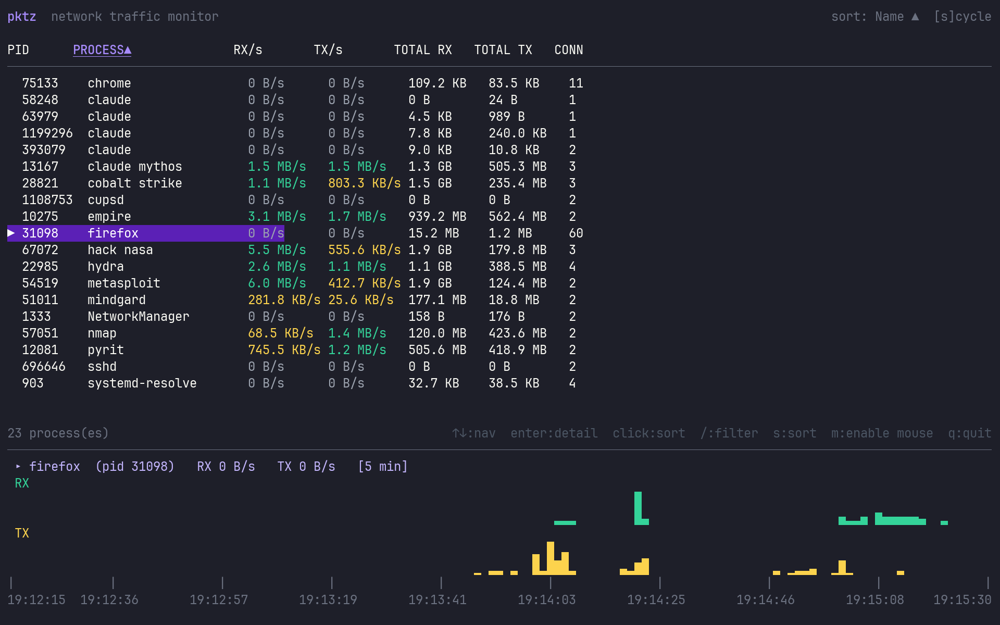
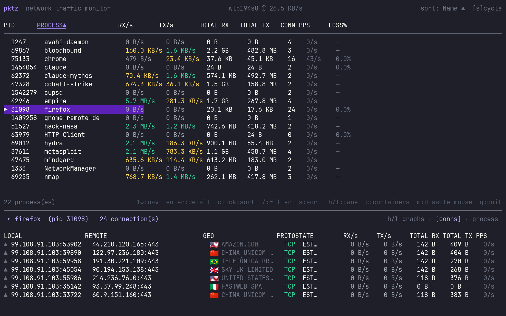
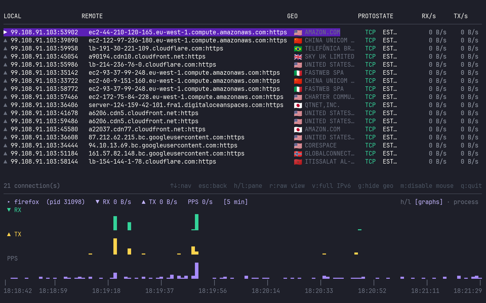

<p align="center">packet-z</p>







# pktz

Your machine is talking to things right now. A lot of things. `pktz` tells you exactly who, how much, and to where — in real time.

Built on eBPF, so it hooks straight into the kernel. No polling `/proc`. No sampling. Every byte, every process, no excuses.

---

## Install

**Download a pre-built binary** (no Go required):

```bash
# replace with your arch: amd64, arm64, armv7
curl -Lo pktz https://github.com/immanuwell/pktz/releases/latest/download/pktz-linux-amd64
chmod +x pktz && sudo mv pktz /usr/local/bin/
```

**Or with Go** (fetches + compiles in one shot):

```bash
go install github.com/immanuwell/pktz@latest
```

The eBPF objects are pre-compiled and bundled in the module, so no `clang` or `bpftool` needed.

**Or build from source** (if you want to hack on it):

```bash
# requires: clang, libbpf-dev, bpftool, Go 1.22+, Linux kernel 5.8+
make install   # builds + copies to /usr/local/bin
```

## Usage

```bash
sudo pktz
```

Needs root to load eBPF programs and read `/proc/<pid>/fd/` for all processes — same deal as `sudo iotop`, `sudo tcpdump`, etc.

---

## What you actually get

**Process list** — every process doing network I/O, with live RX/TX rates and totals. Sorted by name by default, but you can sort by anything.

**Connection drill-down** — hit `Enter` on any process. See every single open connection, its state, rates, remote address. Hit `Esc` to go back.

**Live graph** — 5-minute RX/TX history chart, auto-follows whatever process your cursor is on. Rendered in Unicode block chars, looks goated in a dark terminal.

**GeoIP flags + ASN** — 🇺🇸 CLOUDFLARE, 🇩🇪 HETZNER, 🇷🇺 ???. Optional, see below.

**DNS resolution** — remote addresses show real hostnames instead of raw IPs. You can toggle it off if you want the raw view.

---

## Keybindings

| Key | Action |
|-----|--------|
| `↑` `↓` or `j` `k` | navigate |
| `Enter` | open connection detail |
| `Esc` / `Backspace` | back to process list |
| `s` | cycle sort column |
| `/` | filter processes by name |
| `r` | toggle hostname resolution |
| `v` | toggle compact IPv6 |
| `g` | toggle GeoIP flags |
| `m` | toggle mouse |
| `q` | quit |

Click column headers to sort. Click again to flip direction. Yes, mouse works out of the box.

---

## GeoIP (optional but lowkey essential)

```bash
sudo pktz --download-geoip-db
```

Downloads from DB-IP.com. No account, no license key, nothing. CC BY 4.0. Once downloaded, press `g` to toggle country flags and ASN names in the connection detail view.

Incredibly useful when you're staring at some IP and wondering why your laptop is making friends in unexpected places.

---

## Log mode — pipe it anywhere

```bash
sudo pktz --log | jq .
```

Skips the TUI entirely and emits NDJSON to stdout every 500ms. Every line is either a `"process"` record or a `"conn"` record, both with a `ts` timestamp.

```bash
# top bandwidth hogs right now
sudo pktz --log | jq -r 'select(.type=="process") | "\(.comm) rx=\(.rx_bps|./1024|floor)KB/s"'

# watch a specific process
sudo pktz --log | grep '"comm":"firefox"'

# alert when something crosses a threshold
sudo pktz --log | jq --unbuffered 'select(.type=="process" and .rx_bps > 10000000)' | notify
```

Plays well with anything that reads stdin. Set and forget.

---

## Demo mode — safe for screen sharing

Presenting to an audience and don't want your actual IPs on screen?

```bash
sudo pktz --demo
```

Every IP and hostname gets replaced with a convincing-looking but totally fake one. Stable within the session — same real IP always maps to the same fake — so the display still makes sense.

Want to make it really pop for a talk or a screenshot:

```bash
sudo pktz --fake-processes=chrome,spotify,zoom
```

Injects synthetic processes with animated traffic curves. Implies `--demo`. Looks completely real, is completely fake. ngl it's kind of fun to watch.

---

That's it. Run it, spend 30 seconds poking around, you'll figure out the rest.
